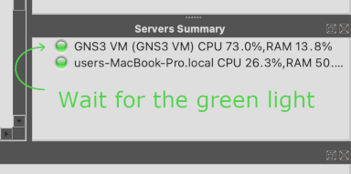
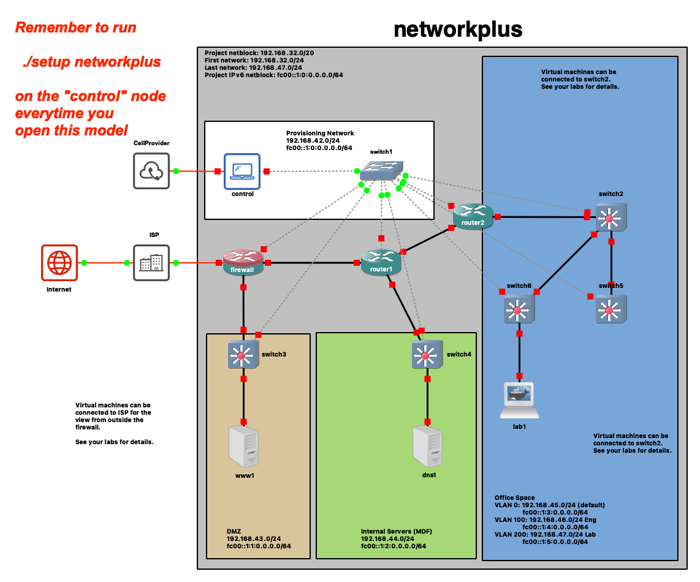

## The Network+ lab environment

# Getting Started
## Configure the virtualization environment for a specific study group (Network+)
These instructions assume you have already installed and configured the software for the Network+ virtual lab environment.  If you haven't or are unsure, run this command:
> ```cd ~/demo && ./setup networkplus```

If you need help, see the ```README.md``` in [demo](https://github.com/dmbrownlee/demo/README.md) for more details.

## Import the network model into GNS3
1. Launch the GNS3 app and wait for the GNS3 VM in VirtualBox to fully boot</br>
  
1. Once the GNS3 VM has booted, in the GNS3 app, go to ```File > Import portable project``` and import the [```~/demo/networkplus/labfiles/networkplus.test.gns3project```](networkplus.test.gns3project) file

GNS3 will open the model when it has finished importing.
## Adding the Virtual Machines
VirtualBox VMs cannot be included in a portable project file.  If a lab requires specific virtual machines, you will need to add the VMs to the model manually after you import the project.  You typically only need to do this once and there is text in the model showing you where to place the icons and to which switch ports to connect them.  If you close and reopen the project, the project, the VMs will still be there and will have saved all their state (i.e. any changes you make in the VMs will be saved when you close the model).  GNS3 assigns each VM a unique identifier.  This means if you delete  and recreate the debian1 VM, for example, then you will have to remove debian1-1 from the model and add it back again because the original icon in the model references the unique identifier of the VM you deleted.

You can find more information about using virtual machines with GNS3 in [lab-002](lab00-2/README.md).
> Note: The Vagrant bases boxes are no longer built by default as this can take a few hours and few labs use them.  You need to created the Vagrant bases boxes before you can create the virtual machines you will manually add to the network model.  To do this, run the following command and then go watch a movie or something because it will take a few hours to complete:</br></br>
> ```cd ~/demo && ./setup -e buildvms=true networkplus```</br></br>
  Fortunately, you only have to do this once and, after that, you can create and destroy VMs at will fairly quickly.

## Opening and using the network model
Follow these steps after opening the network model.
> ***IMPORTANT!*** This model makes extensive use of Docker containers.  When you quit GNS3 or open a different model, GNS3 will close this model and remove its containers.  These containers do not save (all) their state when removed which means you will need to run the steps below every time you open the model.
1. Start all the network nodes by clicking the green triangle in the top button bar and wait for all the links to turn green
1. Open the console on the ```control``` host within the provisioning network (you may have to wait several seconds before you get a login prompt) and login as the provisioning user (```ansible```):
  ```
  username: ansible
  password: password
  ```
1. Run</br>
  <code>./setup networkplus.yml</code></br>
  (you will be prompted for the ansible user's password twice, once for SSH and once for become).

## The Network+ virtual lab environment

