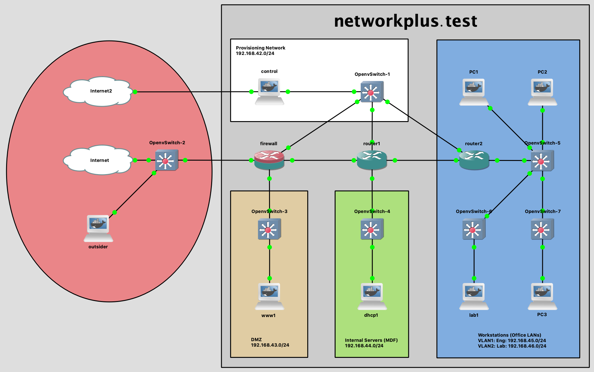

## The Network+ lab environment

# Getting Started
## Configure the virtualization environment for a specific study group (Network+)
If you haven't already done so, run the ```setup``` script in the parent directory with ```networkplus``` as the only argument to setup this virtual lab environment.  See the ```README.md``` in [demo](https://github.com/dmbrownlee/demo/README.md) for more details. For example,
> ```cd ~/demo && ./setup networkplus```

## Import the network model into GNS3
After the GNS3 is installed in the step above, launch GNS3 and wait for the GNS3 VM in VirtualBox to fully boot. Once the VM is booted, download and import [this GNS3 portable project](labnetwork.gns3project) and then follow these steps:
1. Start all the network nodes by clicking the green triangle in the top button bar and wait for all the links to turn green
1. Open the console on the ```control``` docker container (it is in the provisioning network and you may have to wait a few secons in the console for it to finish starting) and login as the ansible user:
  ```
  username: ansible
  password: password
  ```
1. Run</br>
  <code>./setup networkplus.yml</code></br>
  (you will be prompted for the ansible user's password twice, once for SSH and once for become).

## The Network+ virtual lab environment

