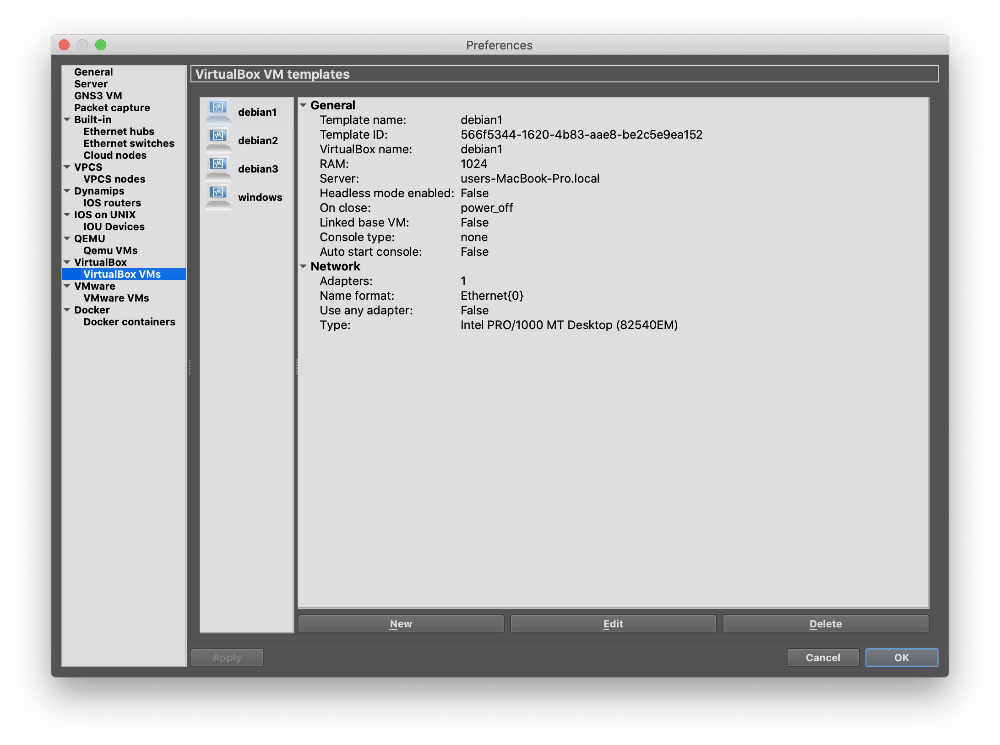

# Introduction to Vagrant and using VirtualBox VMs within GNS3
In this lab, we will get a quick introduction to a small sampling of IT automation tools which demonstrate the Infrastructure as Code paradigm. We will spin up Linux and Windows virtual machines in VirtualBox using Vagrant, a free, cross-platform tool from Hashicorp that helps us quickly spin up virtual machines and discard them when we are done with them using nothing more than text configuration files. Since Vagrant could be further automated in scripts and these scripts and the related configuration files could be checked into source control (in our case, git, a Distributed Version Control System), we will have the tools necessary to create controlled, tested, snapshots of our network models should we want to.  However, for the labs in this course, we will just be using these tools to simplify creating and destroying the virtual machines and will be integrating these into our GNS3 network models manually.

## Setup
First, let's get a quick introduction to some of the tools we have available.
- *[Ansible](https://docs.ansible.com/ansible/latest/index.html)*
    Ansible is a configuration management tool.  It can install software, add users and groups, enable server processes, manage file systems, configure firewalls and network iterfaces, and all sorts of other configuration tasks an admin might do on the local system as well as on remote machines you manage.  Ansible reads a series of tasks from a playbook.  These playbooks are simple text files written in the *YAML* language with each task declaring the state the machine should be in.  For example, a playbook might say user Linda should exist on the system and the nginx web server should be installed and running.  When ansible runs, it compares the state the machine is currently in to what you said you wanted in the playbook and it will make any changes necessary.  You don't need to tell Ansible how to check the state or how to make the changes, it already know that.  You just need to tell it what you want.  The setup script for the demo project is a small shell script that ensures Ansible is installed before running Ansible with a playbook to install the rest of the software.
- *[Vagrant](https://www.vagrantup.com/)*
    We are using VirtualBox as the virualization platform for our virtual machines.  If you have used VirtualBox, VMWare or similar before, you may be familiar with creating virtual machines by hand.  Typically, you would click New Virtual Machine in a GUI, select the virtual hardware including amount of RAM, number of CPUs and disks, etc.  Then you would "insert" the ISO image of the operating system's install disk into the virtual DVD drive and boot the VM.  From there, you would install the operating system as you would on physical hardware.  Once the install is complete, you might install additional software for your particular use case and make some custom tweaks so the UI works the way you want it to.  When you finally have it just the way you want it, if you're smart, you'll make a snapshot of the disk so you can get back to this state quickly if you need to.  This works but is a lot of effort, takes time, and you might forget a step which makes even following written instructions less repeatable, and therefore less reliable, than if you just had the computer do it for you.  Enter Vagrant.  With a simple command, Vagrant can create and provision one or more virtual machines in a fraction of the time they would take to set up by hand and it will produce the same results everytime.  When you run Vagrant commands, they use a configuration file that contains how you want the virtual machines built.  This file is always named Vagrantfile and Vagrant looks for it in the current directory (it will search parent directories until it finds one if there is no such file in the current directory).  Vagrantfile is text file who's format is actually snippets of code in the Ruby programming language so it isn't as easy to read as Ansible's YAML playbooks but you don't need to know how to program in Ruby to write a Vagrantfile, just follow the examples in Vagrant's documentation.  After Vagrant has selected all the virtual hardware it copies an image of a disk with the operating system already installed and configured and then it boots the virtual machine.  In order to be reusable as the starting point for any system, the disk image has a minimalist installation of the operating system. After the virutal machine is booted, Vagrant can optionally run a configuration management system, such as Ansible, to turn the virtual machine into a webserver, a database, or whatever you need it to be.  When you are done with your Virtual machine, a single command will delete it as if it was never there so you can get your disk space bace.  This lab will focus on using Vagrant but there is still the question of where the minimalist disk images, called "base boxes" in Vagrant's terminology, come from.
- *[Packer](https://www.packer.io/)*
    Packer is a free tool for creating disk images for a variety of different virtual platforms. Both locally hosted platforms and cloud platforms are supported.  Packer's configuration file is a text file using the JSON format.  The configuration file specifics which platforms to build for and the steps needed to complete and automated install of the operating systems.  Once it is finished building a virtual machine, its post-processors shutdown the VM and repackage the disk image created for the specific platform.  In our case, packer leaves us with a Vagrant base box file which can be installed into Vagrant's box cache and references in the Vagrantfile for one or more VMs.

Now that the introductions are out of the way, let's learn how to use these tools.

## Lab: Creating VirtualBox virtual machines with Vagrant
1. As mentioned above, Vagrant will look for its configuration file, ```Vagrantfile```, in the current directory. Since this is easy to forget when you're first starting out, let's take a look a the error message you get when you're in the wrong directory.

    ```cd / && vagrant status```

    You can ignore the suggested fixes in the error message since we should already have a ```Vagrantfile``` in a diiferent directory.  Now that we will recognize that error should we forget to change directories, let's change to the correct directory and make sure our ```Vagrantfile``` is there:

    ```cd ~/demo/networkplus && ls```

    The ```Vagrantfile``` file is created by the demo project's ```setup``` script so, if you don't see a ```Vagrantfile``` file in this directory, you should re-run ```cd ~/demo && ./setup networkplus```.
1. You could open the ```Vagrantfile``` to see which virtual machines are defined and how, but for our purposes, we can get the list of the virtual machines defined in the file and their current status with just this command:

    ```vagrant status```

    Virtual machines in the "not created" state do not yet exist in VirtualBox.

1. Recall that Vagrant creates new VMs by copying base box images (disk image files with operating systems already installed). Let's see which base boxes Vagrant already has available in its cache.

    ```vagrant box list```

    Keep in mind these disk images are not used directly but are copied and therefore can each be used as the starting point for mulitple VMs.  For example, all debian VMs defined in the ```Vagrantfile``` will be created using the one debian base box in Vagrant's cache. Let's create one of them now.
    > Note: In order to save time during setup, the Vagrant base boxes are not built by default.  You will not be able continue with this lab until you build the base boxes.  To do this, make sure your laptop is plugged in and connected to the Internet, run ```cd ~/demo && ./setup -e buildvms=true networkplus```, enter your password when prompted, and then go do something else for a few hours while the base boxes are built and installed.
1. Use the ```vagrant up``` command to start one or more virtual machines.  If the machine is in the "poweroff" state, Vagrant will start it.  If the machine is in the "not created" state, Vagrant will first create the virtual machine, boot it, and run the provisioning scripts (if there are any).  The initial creation does take longer than starting a VM that already exists but it's certainly faster (and the results are more repeatedly consistent) than creating the VM and installing the VM by hand.  Let's create the debian1 virtual machine now.

    ```vagrant up debian1```

    It takes a couple minutes to copy the disk, boot the VM, and run the provisioning scripts, but you should be left with a VM you can log into using the username "user" and the password "password".  Back at the shell prompt on the host, if you run ```vagrant status``` again, you will see the status of the virtual machine is now "running".
1. You can shutdown the virtual machine from the command line with ```vagrant halt```.  Let's do that now:

    ```vagrant halt debian1```

    The virtual machine shuts down but is not deleted.  Running ```vagrant status``` again shows the virtual machine is in the "poweroff" state.
1. By default, Vagrant only runs provisioning when the virtual machines are created.  If you change the provisioning scripts, you can re-run them on virtual machines that have already been created by adding the ```--provision``` option to ```vagrant up```.  Let's restart the debian1 virtual machine and re-run the Ansible provisioning script now (although it shouldn't need to change anything since we haven't changed the Ansible playbook since the first time it ran).

    ```vagrant up --provision debian1```

    Note, you can also use ```--no-provision``` if you want Vagrant to create a virtual machine without running the configured provisioning system.
1. Finally, when we no longer need a virtual machine and would like to reclaim the disk space, we can delete the machine entirely with ```vagrant destroy```.  Don't worry, you can always recreate it again with ```vagrant up```, it will just take a couple minutes more as it has to copy the disk image again.  Let's destroy our virtual machine now.

    ```vagrant destroy debian1```

    Vagrant will ask you to confirm that you really want to destroy the virtual machine which is a little silly since ```vagrant up``` will recreate it.  If you find this prompt annoying, you can use ```vagrant destroy -f debian1``` instead to force the destroy operation.

In the steps above, we specified which virtual machine we were working with.  If you run the commands above without the name of the virtual machine, Vagrant will perform the operation on all virtual machines defiend in the Vagrantfile file (although ```vagrant up``` will not create or start machines which have the "autostart: false" attribute in their definition).  We will **not** be using Vagrant to start and stop our virtual machines but we do need to make sure they all exist before we can add them to GNS3 so create all of them now and then shut them down with:

```vagrant up && vagrant halt```

With the virtual machines created and halted, we are now ready to learn how to add them to our GNS3 models.

## Lab: Adding VirtualBox VMs to GNS3 network models

There are a couple of important caveats to keep in mind when using virtual machines in GNS3:

- **You can only have one of each virtual machine in any network model**

    GNS3 can connect a virtual machine to a network model but there is still only one instance of the virtual machine within VirtualBox.  Unlike the built-in switch devices where you can drag as many as you need into your network model, the virtual machines can only appear once.

- **You must start the virtual machines from within GNS3**

    Although you just learned you can start virtual machine using Vagrant, when using a virtual machine within a GNS3 model, you must start it from within GNS3 itself using the green, right pointing triangle icon.  This is because, in addition to starting the VMs, GNS3 also needs to manipulate their virtual network interfaces and connect them to the virtual networks in the model.

- **The networking changes made by GNS3 mean Vagrant can no longer manage the VM**

    Normally, you would be able to re-run the host provisioning scripts on the VM with ```vagrant up --provision, as mentioned above, as well as do other things with Vagrant like connect to the VMs from the host with ```vagrant ssh```.  However, when GNS3 connects the VM to the virtual network in the model, it also disconnects it from the network Vagrant is using.

- **The virtual machines have universally unique identifiers (UUIDs)**

    If you destroy a VM with ```vagrant destroy``` and rebuild it with ```vagrant up```, the VM will have a different UUID.  The consequence of this is, is you will have to delete the template you created for this machine in GNS3 (instructions below) and recreate it.  You may also need to reload your newwork model if it is load with the UUID from deleted VM.

With those considerations in mind, let's add our virtual machines to GNS3.

1. With the VMs shutdown, start GNS3 and, from the ```GNS3``` menu, select ```Preferences``` to open the Preferences dialog.
1. Repeat the following steps for each virtual machine you want to use in GNS3 (don't add the GNS3 VM though):
    1. Select ```VirtualBox VMs``` on the left side of the Preferences dialog and then click the ```New``` button at the bottom.
    1. Select ```Run this VirtualBox VM on my local computer``` in the New VirtualBox VM template dialog and click the ```Next``` button.
    1. Select debian1 from the pre-populated ```VM List``` dropdown and click ```finish```.
    1. Back at the Preferences dialog, select the VM template you just created and click the ```Edit``` button at the bottom of the dialog box.
    1. In the ```VirtualBox VM template configuration``` that pops up, go to the ```Network``` tab, check the ```Allow GNS3 to use any configured VirtualBox adapter```, and click ```OK```

    Depending on which machinces you have created in VirtualBox, the end result might look like this:

    

1. Click ```OK``` to close the Preferences dialog

The virtual machines are now ready for use and should appear in the End Devices and All Devices docks on the left side of GNS3.
