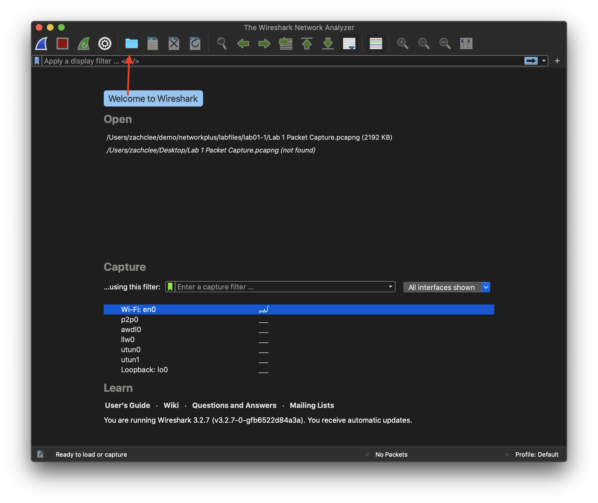
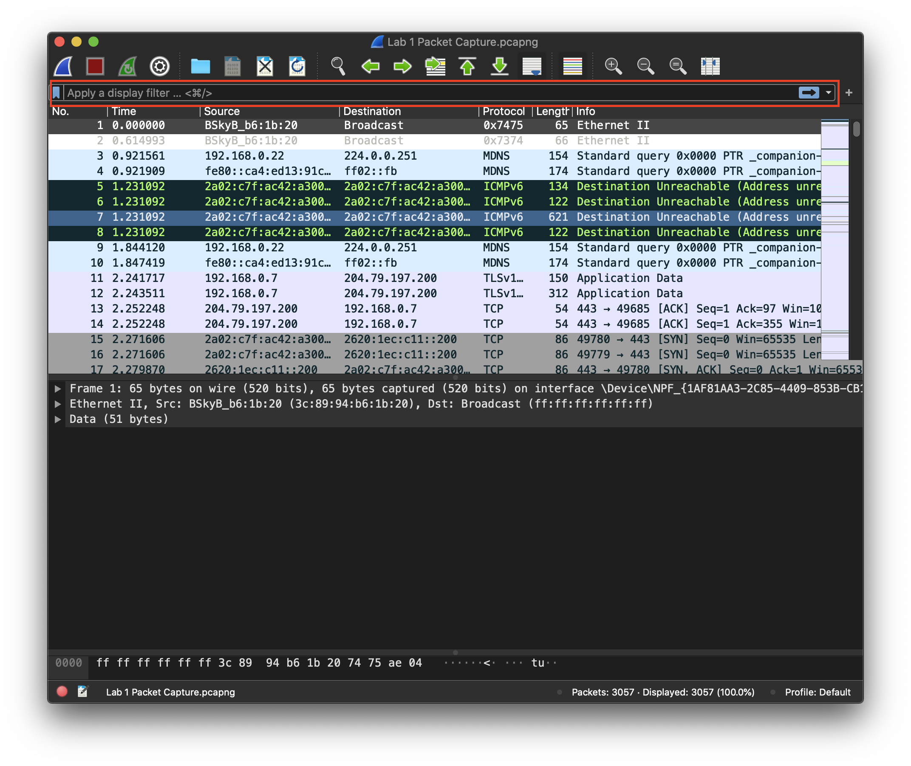
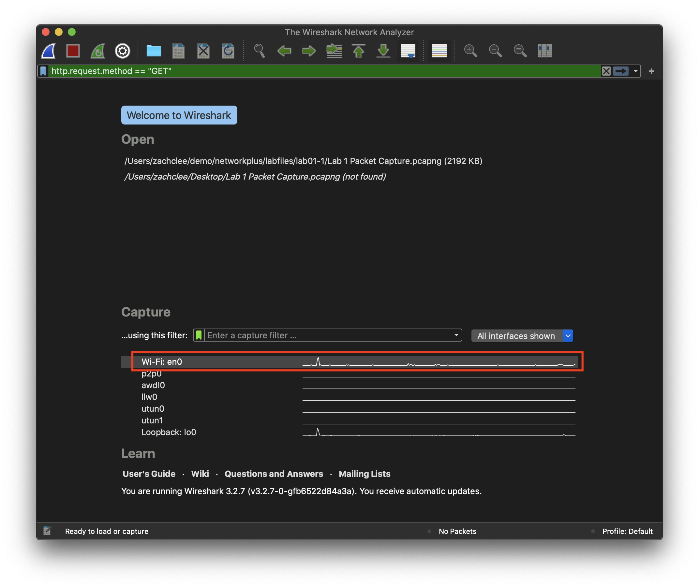
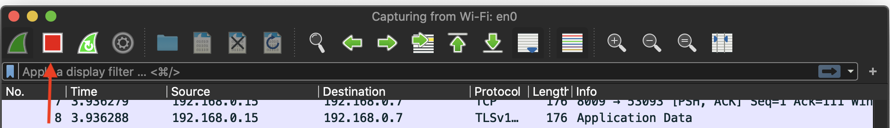

# Intro to Wireshark

In this lab, we will be looking at packets caputured in Wireshark.

## Wireshark

Wireshark is a free and open-source packet analyzer, which is widely used for network troubleshooting, analysis, and communications protocol development.

## Hands-on Practice
1. First open Wireshark. If you're unable to find Wireshark on the Dock located at the bottom of your Macs screen, then press 'CMD + Spacebar' to load Spotlight, and search for Wireshark.
2. Now that Wireshark has loaded, select the 'Open a caputre file' in the top left corner, highlighted in the follow image, and nagivate through the lab 1 packet capture file. This file should be found at '/Users/[USERNAME]/demo/networkplus/labfiles/lab01-1/Lab 1 Packet Capture.pcapng':

3. Look online to find a filter so that you only view the HTTP GET request traffic in this packet capture. You will be able to find a filter at the bottom of the lab, however try to search for one. Enter the filter into the search bar at the top of Wireshark, and highlighted in this iamge:

4. After entering a filter you will only see 3 packets, No. 106, No. 2196, and No.2206.
4. Select packet No.106 to display its details in the bottom section of Wireshark.
3. Contained within the top layer of the output is OSI Layer 1 information. Followed by Layer 2, 3 and 4 PDU information.
4. Select the Layer 2 PDU and find the MAC address for the source machine for the packet No. 106. You should see that the source MAC is : e0:b5:5f:f3:20:7c. Use an online OUI Lookup website 'ouilookup.com', what was the manufacture of the source device? What is the mininum information that you can enter that will ID the vendor based on the MAC address, and why?

## Exercise - Looking for information

1. Load Wireshark and start capturing you own traffic. There are multiple ways to start capturing packets, 1 method is to double click on the interface that you'd like to capture. Immediately after selecting the interface, packets will be captured:

2. When capturing packets, load Chrome and visit www.google.com / a page that you haven't visited on this machine before to avoid caching. (Why would caching cause an issue?)
3. After this, you can stop the capture by pressing the stop button:

4. From the packets you have captured, find your machines IP address, and MAC address.
5. Look for the TCP source port number.
6. Compare the OSI Model and the information within the packets catpured, and look for the corresponding PDU header/trailer information. Can you find such information as:
- Time to live
- Destination MAC Address
- Port numbers
- Checksum
What PDU header/Trailer does this information belong to? Take some time to learn the different OSI layer PDU information as understanding this information and corresponding data is vital when working in with networks.

## Answer
Filter : `http.request.method == "GET"`
