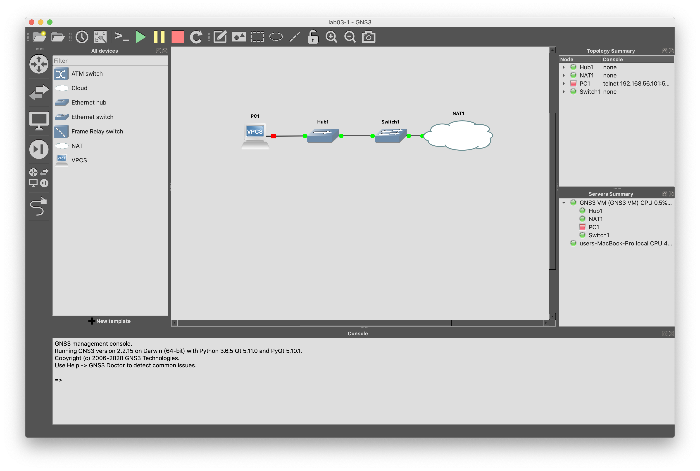
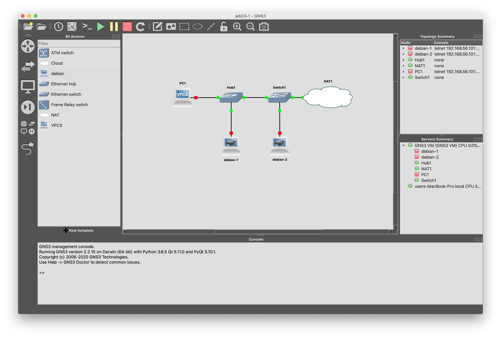

# Hubs vs. Switches (and network sniffer placement)

In this lab, we will be looking at the dfference between hubs and switches.  However, rather than using wireshark from within GNS3 which allows us to tap into links directly, we will be setting up a couple of Debian Docker instances with tcpdump and using those as our network sniffers.

## Setup
Import the network project into GNS3 using File > Import portable project.  The project file is /Users/<user>/demo/networkplus/labfiles/lab03-1/lab03-1.gns3proj.
You should see the following networks:

Now, follow these steps to install Debian Docker instances within your GNS3 setup:
1. Ensure your host machine is connected to the Internet.  GNS3 will need to fetch the Docker images from Docker Hub
1. From the GNS3 menus, choose File > New Template
1. Select "Manually create a new template" and click the Next button
1. Highligh "Docker containers" at the bottom of the sidebar on the left and click the New button
1. Select "Run this Docker container on the GNS3 VM" and click Next
1. Select "New Image", type "debian:latest" in "Image name" field, and click Next
1. For the descriptive name, type "debian" and click Next
1. Leave adapters at the default value (1) and click Next
1. Leave the "Start command" field blank and click Next
1. Leave "Console type" set to "telnet" and click Next
1. Leave the "Environment" text block empty and click Finish
1. Back at the Preferences dialog, click OK

You should now see a "debian" Docker template in the left hand side bar.

In this lab, we will run two debian Docker instances at the same time, each running tcpdump to capture network packets.  Complete the network project by dragging two debian instances into the project.  Use the "Add a link" button at the bottom of the lefthand button bar to link debian-1 to Hub1 and debian-2 to Switch1.  The first time you drag a Docker instance into a project, GNS3 will download and install the Docker instances to the GNS3 VM.  Your network project should now look like this:

Normally, you do not need to assign IP addresses to network sniffers and it is usually prefereable not to.  For example, you might have a sniffer interface as part of an intrusion detection system (IDS) and you would not give it an IP address because you don't want it to respond to any traffic and give away its location.  However, in our lab, the Docker images are completely stripped down to the essentials and don't include tcpdump by default so we will have to assign IP addresses to both debian-1 and debian-2 so we can then install additional software on them from the Internet.  Follow these steps for both Docker instances:

1. BEFORE YOU START THE DOCKER INSTANCES, two finger click (Mac) or right click on debian-1 and choose "Configure" from the top of the pop-up menu
1. Click the Network configuration Edit button at the bottom of the dialog
1. Remmove the "# " from the beginning of the last two lines of the interface configuration (lines beginning with "#" are comments and uncommenting the last two lines will configure this instance to use DHCP to configure the eth0 network interface) and click the Save button
1. Click OK to complete all the changes and then repeat the steps above for debian-2
1. Click the green triangle in GNS3's top button bar to start debian-1, debian-2, and PC1 all at the same time
1. Click the Console button (>_) in GNS3's top button bar to open terminals for debian-1, debian-2, and PC1 (pay attention the name of the machine in the window's title bar to make sure you are running these commands on the correct terminals)

Now, we just need to install and start the network sniffers.  In the terminals for both debian-1 and debian-2, run the following commands:
1. apt update
1. apt install -y man tcpdump
1. tcpdump -n -i eth0 ip

The last command starts capturing IP traffic and will not return a shell prompt.  When you have finished the rest of this lab, you can stop the tcpdump captures using Ctrl-c.

## Hands-on Practice
Now that we have two network sniffers capturing IP packets on our network, it's time to generate some traffic from PC1 and see what we get.

1. First, in PC1's terminal, let's give PC1 an IP address by enabling DHCP on its network interface with the "ip dhcp" command (you can verify this was successfull with "show ip")
1. Next, type "ping 8.8.8.8" to verify PC1 can reach the Internet

## Explain your observations
Observe the difference in what the two network sniffers captured.  Do you know why they have different output when they are both between PC1 and the Internet?  What kind of traffic was the sniffer on debian-2 able to see?
