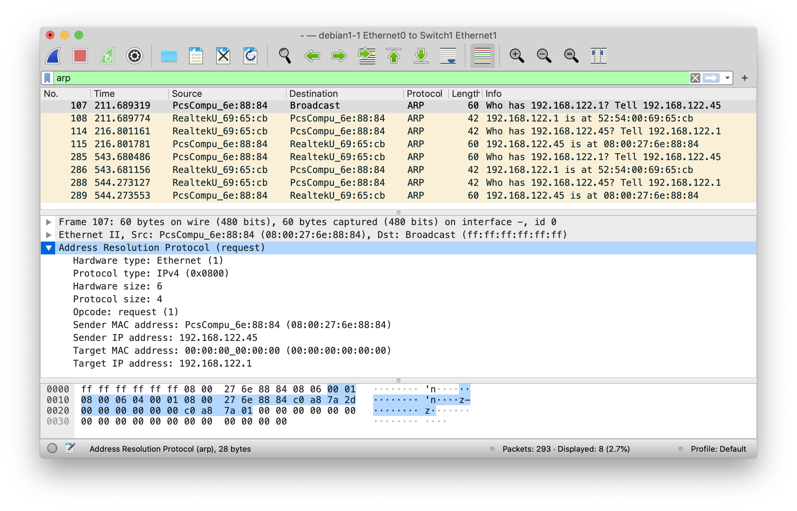

# Finding information about your Ethernet interface in Linux
In this lab, we will take a look a how to find information about your Ethernet interface in Linux.

## Setup
For this lab, we will use the debian1 virtual host.  We will need to install some additional software on the Linux VM so we will need a network map that has the Linux VM conected to a switch and with the switch connected to the Nat device to get out to the Internet.  You can import the portable project in this directory as a starting point and then drag the debian1 VM over and connect it to the switch.  After you have the debian1 VM added to the map, connected to the switch, and booted, follow these steps:

1. Login to the debian1 VM as user/password
1. Open a terminal within the debian1 VM. On Mac hosts, you can open a terminal within the debian1 VM by pressing the left command key, typing "terminal", and pressing enter.
1. In the terminal, run ```sudo apt update``` to ensure you have the latest information about which packages are available for installation.
1. Now run ```sudo apt install -y ethtool net-tools``` to install the software we need.

We can now begin looking up ethernet information in Linux.

## Lab: Exploring ethernet

1. Find your network interfaces
    The first thing you will want to do is identify all your network interfaces.  Historically, Linux and Unix have used the ```ifconfig``` command for this and that still works for MacOS.  However, on modern Linux systems, ```ifconfig``` has been deprecated for the more functional ```ip``` command.  Run this command in the a Linux terminal:

    ```ip link```

    The first interface, ```lo```, is the loopback interface.  The host uses this interface to talk to itself and packets sent "out" this interface come right back "in" on the same interface and never actually reach a network cable.  Therefore, the only way to capture packets on the loopback interface is from on the machine itself.  All IPv4 addresses beginning with 127, including the 127.0.0.1 address with the name "localhost" use this interface.
    Other interfaces will depend on your (virtual) hardware and their names can be changed although the defaults use a consistent naming standard based on type of hardware and location. Look for "link/ether" in the output to identify ethernet interfaces if you are unsure.
1. Check the status of an ethernet interface
    If you have ```ethtool``` installed and admin access, you can check the status of the ethernet interface.  For example, if you have an ethernet interface named ```enp0s3```, use this command to get information about its current state:

    ```sudo ethtool enp0s3```

    The output contains a lot of information.  Some notable lines are ```Auto-nejhgotiation: on``` which says the interface will negotiate with the device on the other side (the switch) as to which settings to use, and the ```Speed: ...``` and ```Duplex: ...``` lines showing the result of the negotiation.  Lastly, the ```Link detected: ...``` line at the end tells you if the network cable is plugged in (which you already knew if you connected to the system remotely via ssh).
1. Down the interface
    "Downing", or disabling, a network interface can also be done using ```ip```.  For example, disable the ```enp0s3``` interface, as root, with:

    ```sudo ip link set enp0s3 down```

1. View an interface that's disconnected.  With the interface down, remove the network cable from the network model and renable the interface with:

    ```sudo ip link set enp0s3 up```

    Besides ```Link detected: no```, you will notice the ```Speed:``` and ```Duplex:``` negotiation have failed.  If you have a Gigabit ethernet interface and you see 100Mbit/Half duplex, that is also often a sign that auto-negotiation has failed and you could be looking at a defective cable.

We have just scratched the surface of link layer settings.  If you need more advanced link layer settings for a project, you might want to look at ```man ip-link``` to see what's possible.

## Lab: Which MAC addresses does your network card process?

When your ethernet card receives a frame of data from the cable, it checks the destination MAC addrees and discards it if it is not the intended recipient.  Obviously, if the destination MAC address matches the MAC address of the interface, the frame is processed.  However, there are other MAC addresses processed as well.  First, there is the broadcast MAC address of ```ff:ff:ff:ff:ff:ff``` used as a destination for frames to be processed by all network nodes. dditionally, multicast frames (i.e. data sent to multiple, but not all, nodes on the network) also have reserved MAC addresses for frames carrying both IPv4 and IPv6 multicast packets.  Lets take a look at how to find these addresses.

1. The broadcast address is fixed at all ones (```ff:ff:ff:ff:ff:ff```).  Both the unchanging MAC address and the unique MAC address of the interface can be seen with:

    ```ip link```

    Note: the first half of the unique MAC address is the Organizationally Unique Identifier (OUI) which is unique to the manufacturer of the chips used in the network interface, can be looked up on sites like the [Wireshark OUI Lookup Tool](https://www.wireshark.org/tools/oui-lookup.html), and, when looking at the sending MAC address, may be able to help you identify the device sending the frame.

1. IPv6 uses multicast packets instead of broadcasts for various functionality so, if you are using IPv6, you will definitely be listening for multicast packets.  Some IPv4 protocols also use multicast packets.  The sender of multicast traffic sends packets to multicast IP addresses without knowledge of how many or which network nodes are listing on those addresses and, regardless, the ethernet frame only has room for one destination MAC address.  Therefore, multicast IP packets make use of special, reserved MAC addresses as the destination MAC in the ethernet frame header.  The specific MAC address used as the destination depends on the multicast address the system is listening to but the prefixes are fixed with all IPv4 multicast addresses (addresses in the 224.0.0.0 - 239.255.255.255 range) corresponding to MAC addresses beginning with 01:00:5E and all IPv6 multicast addresses corresponding to MAC addresses beginning with 33:33:.  To see which multicast MAC addresses your machine will process, run:

    ```ip maddr```

    The lines of output beginning with ```link``` are the layer 2 multicast addresses the interface is processing.

## Lab: Which MAC address will the computer use as the destination MAC?

When your computer sends IP packets, either IPv4 or IPv6, the IP layer determines if the destination IP address in on the same network or if the packet needs to be sent to the default gateway, the router that connects your network to other networks.  Ethernet is not a routable protocol so the destination MAC address is the MAC address of the next machine to process the packet.  In order to find the MAC address for the corresponding IPv4 address (IPv6 works differently), the Address Resolution Protocol (ARP) sends a broadcast packet to all nodes on the network requesting a response from the machine with the IP address of the next machine to process the packet.  Keep in mind, except in the case where the destination machine in on the same network as the sender, the IP address in the ARP request will be the IP address of the default gateway, not the final destination IP address.  If the IP address in the ARP request exists on the network, it will respond with an ARP reply containing its MAC address.  The machine making the initial ARP request will save the response in an ARP cache.  Let's look at this in practice.
1.  Traditionally, the ```arp``` command has been used to view the ARP cache on Unix and Linux systems and that still works (on MacOS, you can use ```arp -a -n```):

    ```sudo arp -n```

    You will likely see an entry for your default gateway still in the cache from earlier when we installed the ethtool and net-tools packages.  The net-tools package includes legacy networking commands like ```arp``` and ```ifconfig``` that experienced sysadmins may be familiar with from other Unix systems.  Like ```ifconfig```, ```arp``` has been replaced with the more capable ```ip``` command which is already installed.  To see the ARP cache with ```ip```, use:

    ```ip neighbor list```

    You'll notice this also tells us the state of this ARP cache entry in the last field which is likely ```STALE``` if it has been more than a minute since you used your default gateway.  Let' remove the ARP cache entry entirely with:

    ```ip neighbor del 192.168.122.1 dev enp0s3```

    Running ```ip neighbor list``` again shows the entry is no longer in the ARP cache.
1. With the ARP cache entry removed, let's now start a packet capture on the link between the debian1 VM and the switch by two-finger clicking on the link and choosing "Start capture" from the pop-up menu.  This lauches the Wireshark packet sniffer and you may already see spanning tree protocol (STP) and other packets getting captured.  Since we are only interested in watching the ARP conversation, type "arp" in the display filter at the top of Wireshark and press enter.  Wireshark is still capturing packets but it only displays the ARP packets.  Now go back to the debian1 VM and, in a terminal, run "ping -c 3 8.8.8.8".  This sends three ping packets to Google's public DNS server at 8.8.8.8 but, before it can do that, your machine will have to send an ARP request to find the default gateway's MAC address and then save the reply in the ARP cache.  Stop the packet capture in Wireshark and take a look at the ARP request and reply packets.



1. Finally, re-run:

    ```ip neighbor list```

    The response from the gateway is saved in the ARP cache and will have the fresh state of ```REACHABLE``` for the next 60 seconds.
