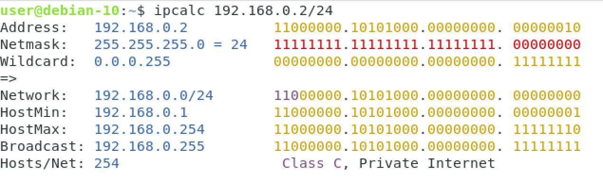

# Network Addressing

Throughout this lab, we will be looking at DHCP using GNS3 to capture the DORA process. We'll also walk through how to assigned an host within GNS3 with both Static and Dynamic IP address, finishing up with some subnetting questions.

## Subnetting
Subnetting is an important skill for a network engineer. There are an array of tools available to an engineer to make this task easier. We will be using a Terminal utility called 'ipcalc'. By now, starting a Debian VM should be like second nature, so ahead and start an instance. Once you've signed into the machine, go ahead and load a Terminal, and install the ipcalc tool by entering `sudo apt install ipcalc`, followed by your password. The tool will take a minute or two to install.

ipcalc takes an IP address and netmask and calculates the resulting broadcast, network, and wild card addresses, along with information about the number of hosts, and available IP address for that subnet.

To use ipcalc, in a Terminal prompt, enter `ipcalc 192.168.0.2/24`. You'll see the following output:

From the output, we can see the first available host ip address available within this subnet '192.168.0.1' and the last available ip address that can be assigned to a host '192.168.0.254'. Along with the broadcast IP address, and total number of available IP address that can be assigned within this subnet. The output also displayed the class that the IP address falls into, in this example, the 192.168.0.2 address is a Class C, Private.

Go ahead and use this tool with the follow examples. Confirm what the range of available IP address are, total number of of IP available, and what class the address falls into.

 - put examples into here

Though using a tool is quicker and easier, calculating this information manually is a great skill to have. Chapter 6 walked you through the steps for manaully calcualting this information. If you're unsure, go ahead and re-read this part of the chapter. Once you're ready, try to manually calculate the first, and last host IP address available, along with the broadcast and class of the following IP address:

 - put questions here

## Static and Dynamic
How to configure both static and dynamic.

## DHCP and DORA 

After reading chapter 6, you should now understand the use of DHCP. In quick, DHCP is used to provide automatic IP address assignment to hosts that want to connect to a network. For hosts automatically be supplied with an IP address, a host requring an IP address would us a process called DORA. The DORA process has 4 messages:
- Discover
- Offer
- Request
- Acknowledgment

Frist, lets capture the DORA process in GSN3. Open GNS3 and load this labs 'lab06-1.gns3project' file, then start the debian1-1 VM by clicking on the VM icon with two fingers, and selecting start:

Once the VM has started and you've signed in, go back to GNS3 and hover your mouse over the the link from the debain VM to the switch, right click (select with two fingers), and select 'start capture'. In the next box we can leave the default values, and select 'OK':

Wireshark should automatically open, however if it doesn't, right click (two finger click) on the link between the Debian VM and the switch again, and select 'Start Wireshark'. Once Wireshark has loaded, you should see packets already beening captured:
 

We're now going to force our Debian host to use the DHCP DORA request. Using the Debain VM, open a Terminal by selecting Activities in the top left of the windows, type 'Terminal' into the search tool (or search manually through the applications, and select the Terminal app:

First, we will need to release any IP address that is already assigned to the machine on boot. To do this, type `sudo dhclient -r`, where the '-r' flag explicitly releases the current lease, enter the account password when prompt. Now we need to request a new DHCP lease. In the same terminal window, enter `sudo dhclient` to request a new lease.

Now go back to Wireshark and stop the packet capture. You may have captured a lot of network traffic, so you'll need a fitler to only display the DHCP messages. In the filter, enter 'BOOTP'. DHCP is implemented as an option of BOOTP, however is beyond the scope of this lab, however you'll be able to find plenty of information on BOOTP online. Now, you'll see the DORA messages: 

Compare the output in the above image to your own capture. You should first see the message to the DHCP server, releasing the IP address. This informs the DHCP server that the current lease is no longer required, and that the IP address can be issued to a new device. This is not a part of DORA.

The following messages are DORA messages. Looking within the 'Info' column, you can see DORA:
 

GREAT! We've just seen DORA and DCHP in action. Thought the Network+ doesn't require you to have in-depth knowledge of the workings of DHCP, hopefully you're intrigued to know more! Take some time to do some additional research into DORA, and try to answer these questions:
1. What does each messaging within the DORA process do?
2. How does a new host on a network know where to send DHCP request messages? 
3. How does the DCHP server know where to send responses if the new host doesn't have an IP address yet?

# ipcalc - sudo apt install ipcalc
