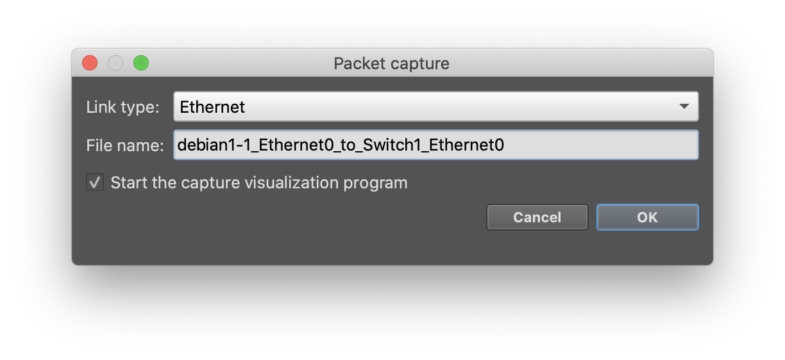
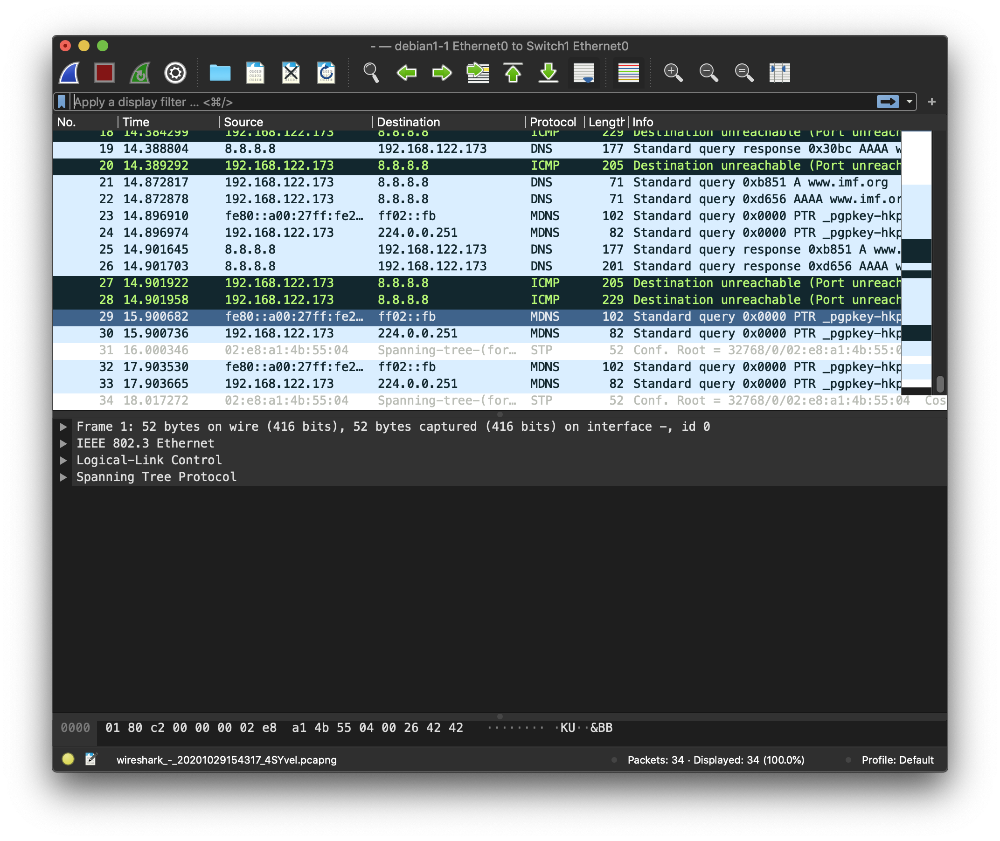
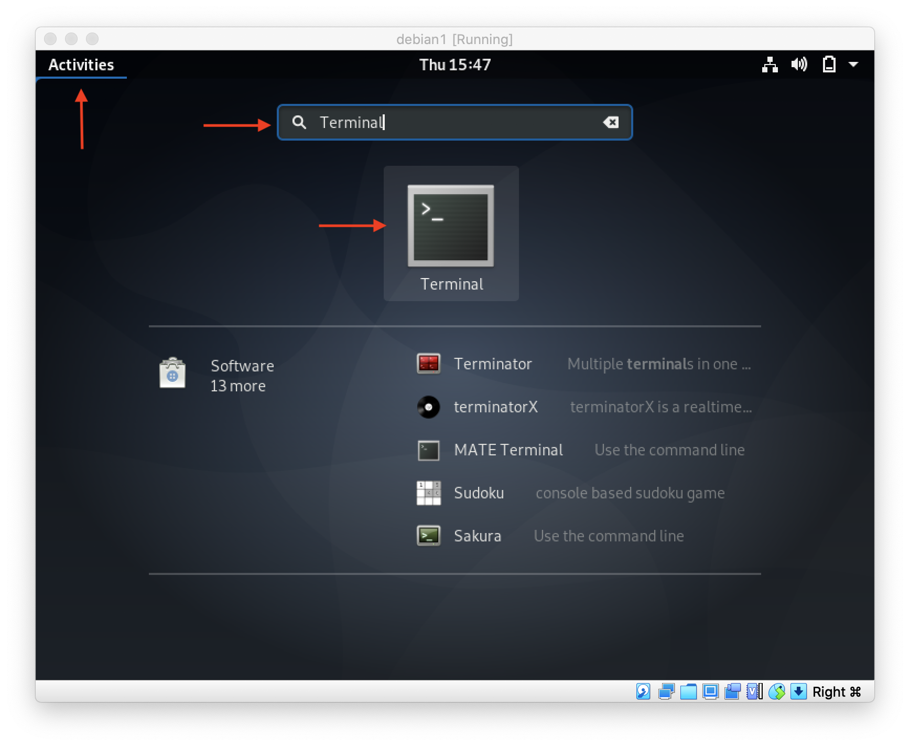
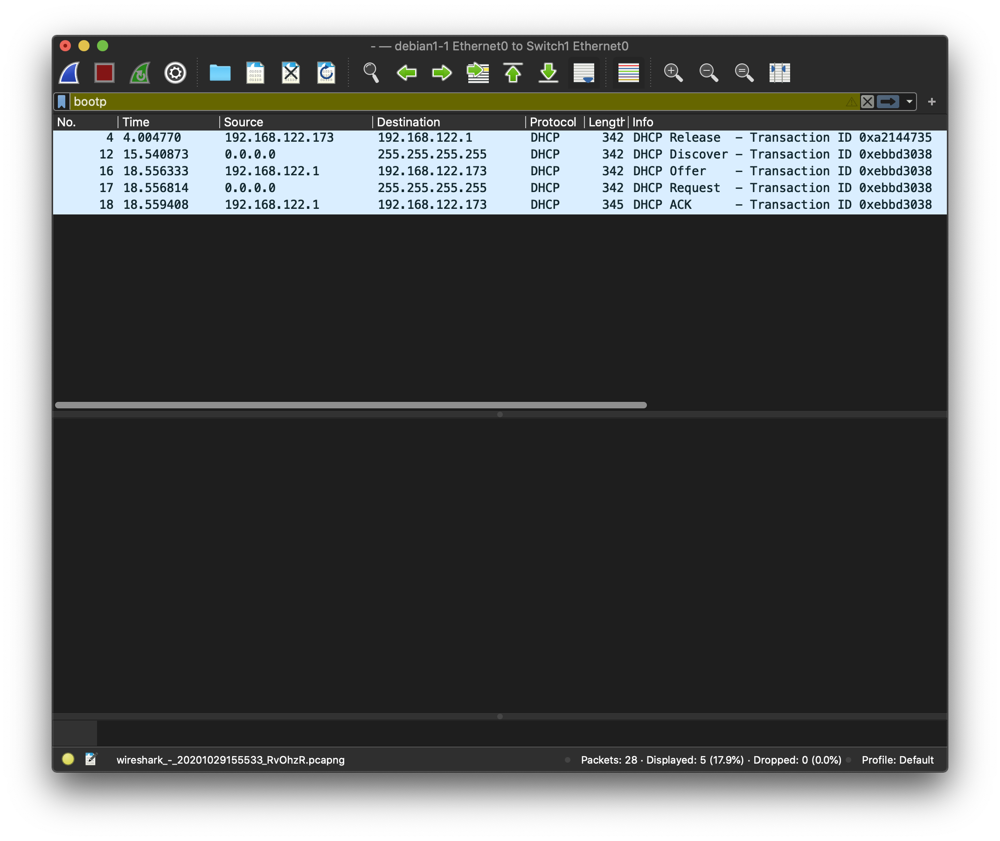
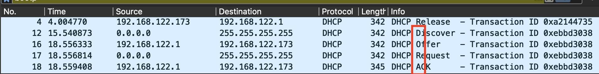

# Network Addressing

Throughout this lab, we will looking at the process of subnetting, IP address assignment, both static and dynamic, finally finishing with an introduction to DHCP and DORA.  You can do this lab using the network model installed in the Network+ lab environment [README](https://github.com/dmbrownlee/demo/blob/release/networkplus/labfiles/README.md).  Also, remember to start the VM from within the model so that GNS3 can patch it to the virtual network.

## Subnetting
Subnetting is an important skill for a network engineer. There are an array of tools available to an engineer to make this task easier. We will be using a Terminal utility called 'ipcalc'. By now, starting a Debian VM should be like second nature, so ahead and start an instance. Once you've signed into the machine, go ahead and load a Terminal, and install the ipcalc tool by entering:</br>
```
sudo apt install ipcalc
```
The tool will take a minute or two to install.

ipcalc takes an IP address and netmask and calculates the resulting broadcast, network, and wild card addresses, along with information about the number of hosts, and available IP address for that subnet.

To use ipcalc, in a Terminal prompt, enter `ipcalc 192.168.0.2/24`. You'll see the following output:
```
student@debian1:~$ ipcalc 192.168.0.2/24
Address:   192.168.0.2          11000000.10101000.00000000. 00000010
Netmask:   255.255.255.0 = 24   11111111.11111111.11111111. 00000000
Wildcard:  0.0.0.255            00000000.00000000.00000000. 11111111
=>
Network:   192.168.0.0/24       11000000.10101000.00000000. 00000000
HostMin:   192.168.0.1          11000000.10101000.00000000. 00000001
HostMax:   192.168.0.254        11000000.10101000.00000000. 11111110
Broadcast: 192.168.0.255        11000000.10101000.00000000. 11111111
Hosts/Net: 254                   Class C, Private Internet

student@debian1:~$
```

From the output, we can see the first available host IP address available within this subnet is '192.168.0.1' and the last available IP address that can be assigned to a host '192.168.0.254'. Along with the broadcast IP address, and total number of available IP address that can be assigned within this subnet. The output also displayed the class that the IP address falls into, in this example, the 192.168.0.2 address is a Class C, Private.

Go ahead and use this tool with the follow examples. Confirm what the range of available IP address are, total number of of IP available, and what class the address falls into.

- 10.0.0.5/19
- 172.18.56.176/26
- 192.168.10.50/28

Though using a tool is quicker and easier, calculating this information manually is a great skill to have. Chapter 6 walked you through the steps for manaully calcualting this information. If you're unsure, go ahead and re-read this part of the chapter. Once you're ready, try to manually calculate the first, and last host IP address available, along with the broadcast and class of the following IP address:

### Practice
- 10.0.0.1/8
- 172.16.50.45/16
- 192.168.99.90/24
- 192.168.63.12/29
- 128.16.132.57/27
- 223.17.19.246/29

Compare your calculations to output given by ipcalc. Mastering subnetting can take time. You can find additional practice questions at the following:
- www.subnettingquestions.com
- www.subnetting.org

## Static and Dynamic
IP Addresses can be assigned two ways. As you've learned after reading chapter 6, a host can either be assigned with a static or dynamic address. A static address means that the machine won't change IP address, where as with dynamnic, the address many change over time. There are use cases for both methods in todays world of networking.

To set the type of network address assignment, we'll be using 'nmcli', that is, the command-line NetworkManager tool. Using the command-line tool means that you can take advantage of auto completion. Give it ago! To set the network interface as static, using the following command:
```
student@debian1:~$ nmcli connection modify Wired\ connection\ 1 ipv4.method manual ipv4.addresses 1.1.1.100/8 ipv4.gateway 1.1.1.254 ipv4.dns 1.1.1.1
student@debian1:~$
```
Whilst you're typing the command in, trying pressing the tab key. If there is only one matching option, it will be auto completed. For example, type `nmcli c` and then press the tab key to have it type out the rest of "connection" for you.  If there is more than one option available, press tab a second time and you'll see all available options. For example, press tab twice after `nmcli connection` to see a list of all the words that can follow in a syntactically correct command.  However, if there are no options available, you won't get any output and you'll need to check your command for typos.

Now that you have modified the settings for the `Wired connection 1` connection, the last step is to reactivate the connection with the new settings. You can do this with:
```
student@debian1:~$ nmcli connection up Wired\ connection\ 1 
Connection successfully activated (D-Bus active path: /org/freedesktop/NetworkManager/ActiveConnection/2)
student@debian1:~$
```

Success! The network interface has now been set with a static IP address, static gateway, and static DNS server. You can verify this using the following Linux commands:</br>
- ```
  student@debian1:~$ ip address
  1: lo: <LOOPBACK,UP,LOWER_UP> mtu 65536 qdisc noqueue state UNKNOWN group default qlen 1000
      link/loopback 00:00:00:00:00:00 brd 00:00:00:00:00:00
      inet 127.0.0.1/8 scope host lo
        valid_lft forever preferred_lft forever
      inet6 ::1/128 scope host 
        valid_lft forever preferred_lft forever
  2: enp0s3: <BROADCAST,MULTICAST,UP,LOWER_UP> mtu 1500 qdisc pfifo_fast state UP group default qlen 1000
      link/ether 08:00:27:a3:db:bd brd ff:ff:ff:ff:ff:ff
      inet 1.1.1.100/8 brd 1.255.255.255 scope global noprefixroute enp0s3
        valid_lft forever preferred_lft forever
      inet6 fe80::a00:27ff:fea3:dbbd/64 scope link noprefixroute 
        valid_lft forever preferred_lft forever
  student@debian1:~$ 
  ```
  The `ip` command is a Linux specific replacement for Unix's `ifconfig` (still used on Mac OS).  "Address" is the default command beginning with "a", so you can shorten this to just `ip a`.  The first interface listed, `lo`, is the loopback address and has the IP address/netmask `127.0.0.1/8` (`inet` is the line referring to IPv4 and `inet6` is the line referring to IPv6).  The `enp0s3` is the network interface associated with the "Wired connection 1" connection and we can confirm the IPv4 address/netmask is now `1.1.1.100/8`.
- ```
  student@debian1:~$ ip route
  default via 1.1.1.254 dev enp0s3 proto static metric 100
  1.0.0.0/8 dev enp0s3 proto kernel scope link src 1.1.1.100 metric 100
  169.254.0.0/16 dev enp0s3 scope link metric 1000
  student@debian1:~$
  ```
  The `ip route` command displays the hosts routing table.  The first line shows the `default` route and we can confirm that, when no better route it present, the host will send packets to the default gateway at `1.1.1.254`.
- ```
  student@debian1:~$ cat /etc/resolv.conf 
  # Generated by NetworkManager
  nameserver 1.1.1.1
  student@debian1:~$
  ```
  Lastly, we can use the `cat` command to dump the contents of the `/etc/resolv.conf` file to the screen.  The host's resolver libray uses this file for its DNS client configuration.  We can see that NetworkManager updated the IP address of the namesever to `1.1.1.1`.

Note, in our network model, the debian1 VM is connected to the 192.168.45.0/24 network.  Will the static address assigned above work on this network?  Can you you choose static network settings that will work? The router is using 192.168.45.254 so don't choose that.

Try setting the network interface on your debian VM with your own custom settings, changing the address information in the previous command. Use your new subnetting knowledge to calculate suitable IP address information.

To set the interface back to dynamic, using DHCP, type the following `nmcli connection modify Wired\ connection\ 1 ipv4.method auto ipv4.addresses "" ipv4.gateway "" ipv4.dns ""`. Here we are deleting the custom settings that we've set and cofiguring the connection method back to "auto" (DHCP). Then we need Network Manager to apply our updated connection to the NIC: `nmcli connection up Wired\ connection\ 1`.

You can see the whole nmcli connection settings by entering `nmcli connection show Wired\ connection\ 1`. Enter this command. What other information can you see?

At this point, you might be wondering why the character \ appears throughout the command. Unfortunately, the network interface name has spaces, this can cause issues with commands on the terminal, however, nmcli requires you to enter the full interface name. To solve this we use the \ character. This character tells the command-line to ignore the space as a special character, which allows us to use it for the name.

## DHCP and DORA 

After reading chapter 6, you should now understand the use of DHCP. In quick, DHCP is used to provide automatic IP address assignment to hosts that want to connect to a network. For hosts automatically be supplied with an IP address, a host requring an IP address would us a process called DORA. The DORA process has 4 messages:
- Discover
- Offer
- Request
- Acknowledgment

In this part of the lab, we will use Wireshark to view DHCP network traffic.  Since we would like to capture the DHCP traffic sent from the debian1-1 VM as it starts, power off the debian1-1 VM before starting.

1. Hover your mouse pointer directly over the the link from the Debain VM to the switch (it will turn red when you are over it), right click (select with two fingers), and select 'Start capture'. In the next box we can leave the default values, and select 'OK':
  
  Wireshark should automatically open and begin capturing packets on the virtual link.
   
1. Start the debian1-1 VM.  If the VM was already running, we can force our Debian host to resent the DHCP request. To do this, open a Terminal by selecting Activities in the top left of the windows, type 'Terminal' into the search tool (or search manually through the applications, and select the Terminal app:
  
  Next, we will need to release any IP address that is already assigned to the machine on boot. To do this, type `sudo dhclient -r`, where the '-r' flag explicitly releases the current lease, enter the account password when prompt. Now we need to request a new DHCP lease. In the same terminal window, enter `sudo dhclient` to request a new lease.
1. Now go back to Wireshark and stop the packet capture. You may have captured a lot of network traffic, so you'll need a fitler to only display the DHCP messages. In the filter line below the buttons at the top, enter `dhcp` (note, the image below shows the filter as `bootp` which is an older boot protocol, largely replaced by DHCP). Now, you'll see only the DHCP traffic: 


Compare the output in the above image to your own capture. You should first see the message to the DHCP server, releasing the IP address. This informs the DHCP server that the current lease is no longer required, and that the IP address can be issued to a new device. This is not a part of DORA.

The following messages are DORA messages. Looking within the 'Info' column, you can see DORA:
 

GREAT! We've just seen DORA and DCHP in action. Though the Network+ doesn't require you to have in-depth knowledge of the workings of DHCP, hopefully you're intrigued to know more! Take some time to do some additional research into DORA, and try to answer these questions:
1. What does each messaging within the DORA process do?
2. How does a new host on a network know where to send DHCP request messages? 
3. How does the DCHP server know where to send responses if the new host doesn't have an IP address yet?
