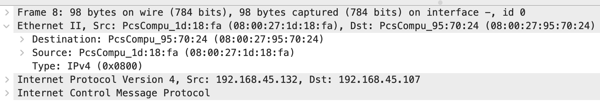
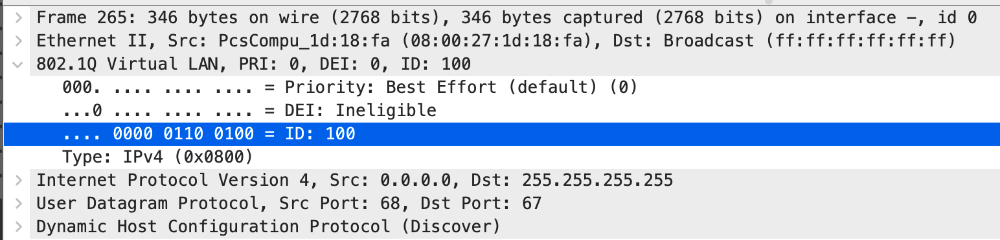
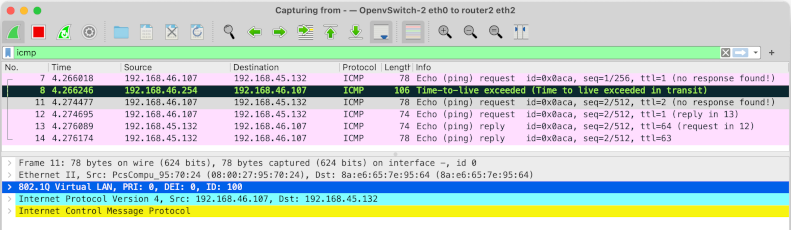

# LAB 11-1 VLANs

## OBJECTIVE

In this lab, you will learn about VLANs and how they function like a virtual switch and, potentially, span many physical switches.  You will also learn how to view VLAN IDs in Wireshark captures and where to place the network sniffer in order to capture this information.  This lab is **not** a primer for learning about OpenvSwitch although we do use it in the lab and you may want to learn more about it at [openvswitch.org](https://www.openvswitch.org/).

## SETUP
This lab uses the [networkplus.test](https://github.com/dmbrownlee/demo/blob/release/networkplus/labfiles/README.md) network model.

Before beginning the lab, you will need to configure ports on the OpenvSwitch switches as either access ports or trunk ports (the VLAN interfaces are already configured on router2:eth2).  Open a console and run the commands below on the switches as indicated.

1. Open a console on switches 2, 5, and 6 and then use the following command to get an admin shell:

   ```
   sudo -i
   ```
   > Note: The current configuration on our switches requires 'root' privileges to make changes.  The commands below may fail if you are not using an admin shell.

1. On all three switches, use the following shell loop to configure ports 1 through 15 as access ports:

  ```
  for p in $(seq 1 15); do
    ovs-vsctl set port eth$p vlan_mode=access tag=1 trunks=[]
  done
  ```

  > Note: Port 0 is currently being used as the switch management interface so it is not attached to the internal bridge on the switch, ```br0```.

1. On switch2, use the following commands to
    - configure eth1 as a trunk line for VLANs 0 and 100
    - configure eth2 as a trunk line for VLANs 0 and 200
    - configure eth3 as a trunk line for VLANs 0, 100, and 200

  ```
  ovs-vsctl set port eth1 vlan_mode=native-untagged tag=1 trunks=[0,100]
  ovs-vsctl set port eth2 vlan_mode=native-untagged tag=1 trunks=[0,200]
  ovs-vsctl set port eth3 vlan_mode=native-untagged tag=1 trunks=[0,100,200]
  ```
  You can verify your work with
  ```
  ovs-vsctl --columns=name,vlan_mode,trunks,tag find Port name=eth1
  ovs-vsctl --columns=name,vlan_mode,trunks,tag find Port name=eth2
  ovs-vsctl --columns=name,vlan_mode,trunks,tag find Port name=eth3
  ```
1. On switch5, use the following commands to configure eth1 as a trunk line for VLAN 0
  ```
  ovs-vsctl set port eth1 vlan_mode=native-untagged tag=1 trunks=[0]
  ```
  You can verify your work with
  ```
  ovs-vsctl --columns=name,vlan_mode,trunks,tag find Port name=eth1
  ```
1. On switch6, use the following commands to configure eth1 as a trunk line for VLANs 0 and 200
  ```
  ovs-vsctl set port eth1 vlan_mode=native-untagged tag=1 trunks=[0,200]
  ```
  You can verify your work with
  ```
  ovs-vsctl --columns=name,vlan_mode,trunks,tag find Port name=eth1
  ```
> Note: VLAN 0 is a special VLAN for packets that don't know which VLAN they belong to.  In this case, we need to pass VLAN 0 traffic on the trunk lines or DHCP will not work.

## STEPS

### VLAN background info
All the devices connected to a switch form a network.  Switches supporting VLANs can assign their ports to different VLANs, or virtual networks, essentially turning the physical switch into multiple virtual switches.  For example, a 16-port switch with ports 0-7 on VLAN 100 and ports 8-15 on VLAN 200 functions just like two physical 8-port switches.  Traffic is only shared between ports on the same VLAN.  Devices on separate VLANs cannot communicate with each other unless there is a router to route traffic between VLANs.  Routing between two networks happens at the Internet layer which is layer three of the OSI model whereas switching works to move data between two MAC addresses at the data link layer which is layer two of the OSI model.  A layer three switch is a switch that also includes a built-in router to support IP routing between VLANs as well as all the layer two switching functions all switches have.

VLANs are identified by a numeric ID between 0 and 4095.  On Cisco devices, VLAN 1 is the default VLAN ID to which ports are assigned. The default VLAN ID cannot be changed or deleted but you can assign ports to different VLAN IDs.  VLAN 0 is reserved for special use cases (when a frame needs a VLAN header but the VLAN is unknown).  Other VLAN IDs may be reserved for special use depending on the vendor of the networking gear. When assigning VLANs on Cisco devices, choose VLAN IDs in the 2-1005 range to avoid conflicts with IDs reserved for internal use.

Switch ports are "tagged" or "untagged".  A switch does not expect VLAN headers on ethernet frames received on untagged ports and will not include VLAN headers on frames leaving through untagged ports. If an untagged switch port receives a frame with an 802.1q VLAN header in it, the frame will be discarded.  Conversely, switches will expect 802.1q VLAN headers to be present in frames coming in through tagged ports and will ensure VLAN headers exist on frames leaving tagged ports.

Switch ports can be used as "access" ports or "trunk" ports.  Access ports, the ports to which hosts are connected, are untagged.  This means the connected device does not need to be configured to add VLAN headers to the frames it sends out.  When a switch receives a frame on an untagged access port, it is automatically assigned to the port's VLAN.  Conversely, trunk ports are tagged.  Switches are connected to each other using trunk ports on both sides of the link.  This way, a switch can tell which VLAN a frame belongs to even if it originally came in on a port on a different physical switch.  Trunk ports can be configured to accept frames for specific VLANs.  Frames with other VLAN IDs will be dropped.  This means, for example, if you have two switches with ports on VLAN 200 and the trunk ports are not passing VLAN 200 traffic, then you have two different networks which both happen to have the same VLAN ID of 200.  This is confusing and probably not what you want.

If a frame without any 802.1q VLAN header is received on a trunk port, it is assigned to the trunk's "native" VLAN ID.  By default, the native VLAN is also VLAN 1 on Cisco, but the native VLAN ID can be changed on each trunk port. When a frame belonging to the native VLAN exits through a trunk port, the VLAN header is not included.  Therefore, the trunk ports on both sides of the link should be configured to use the same VLAN ID as the native VLAN.

> Note: The above describes Cisco's trunk lines.  In OpenvSwitch, ports with vlan_mode set to "trunk" do not accept frames without VLAN headers.  To get the same behavior as Cisco in OpenvSwitch, set the port's vlan_mode to "native-untagged" and set "tag" to the VLAN ID you want to use as the native VLAN.

### Observing standard ethernet frames
As mentioned above, untagged access ports can be reassigned to other virtual networks by replacing the default VLAN ID of 1 with a different VLAN ID.  We will do that now on the access ports to which debian1-1 and debian2-1 are connected.

> Note: debian1-1 and debian2-1 are VirtualBox VMs.  debian1-1 should be connected to port 4 on switch2 and debian2-1 should be connected to port 15 on switch5.

1. Login to debian1-1, open a terminal, and run ```ip -br a``` to find the IP address of the ethernet interface.  It should have received a random address in the 192.168.45.0/24 range from the DHCP server.
   > Note: There is not a one to one mapping of networks to DNS zones, but you can also run `dnsdomainname` to see the domain name you got back from the DHCP server.

1. Repeat the previous step on debian2-1 and confirm they are both on the same network.

1. Start a packet capture on the link between switch2 and switch5 and filter on ICMP packets

1. Ping debian1-1 from debian2-1 to confirm the two machines can reach each other.
   > Note: There is no dynamic DNS configured on the network so you need to ping by IP address.

1. Review the ethernet frames captured by Wireshark during the ping.  Observe there are no VLAN headers in these frames.

   

1. Stop the packet capture and close Wireshark

### VLANs are virtual networks within physical switches

1. Login on debian1-1 and observe its current network configuration:

  ```
  ip -br a
  ```

1. Login to switch2 and assign port 4 to VLAN 100 with the following command:

  ```
  ovs-vsctl set port eth4 vlan_mode=access tag=100
  ```

  You can verify your work with

  ```
  ovs-vsctl --columns=name,vlan_mode,trunks,tag find Port name=eth4
  ```

1. Start a network capture on the link between switch2 and debian1-1 and set the filter to only view DHCP packets.

1. Login to debian1-1 and run the following commands to reset the network interface:

  ```
  sudo nmcli conn down Wired\ connection\ 1
  sudo nmcli conn up Wired\ connection\ 1
  ```

1. View the network configuration on debian1-1 with:

  ```
  ip -br a
  ip route
  ```

  Notice debian1-1 is now on 192.168.46.0/24, a completely different network than before, with a different gateway.
   > Note: As previously mentioned, there is not a one to one mapping of networks to DNS zones. However, you can run `dnsdomainname` to see this particular network is part of a different DNS zone and the domain name you got back from the DHCP server has changed. This just happens to be how this network was configured.

1. Stop the network capture and observe there are still no VLAN headers in the ethernet frames in the DHCP traffic to and from debian1-1.  The host was able to change networks without any reconfiguration on either the host or the DHCP server.

1. Like you did previously above, login to switch5 and assign port 15, debian2-1's port, to VLAN 100 with the following command:

  ```
  ovs-vsctl set port eth15 vlan_mode=access tag=100
  ```

  You can verify your work with

  ```
  ovs-vsctl --columns=name,vlan_mode,trunks,tag find Port name=eth15
  ```

1. Start a network capture on the link between switch2 and switch5 and set the filter to only view DHCP packets.

1. Login to debian2-1 and run the following commands to reset the network interface:

  ```
  sudo nmcli conn down Wired\ connection\ 1
  sudo nmcli conn up Wired\ connection\ 1
  ```

  Notice attempting to bring up the interface took a longer and eventually failed.  You can confirm the DHCP request failed but checking the existing configuration on debian2-1 and viewing the Wireshark packet capture.  Why are there no DHCP packets in the capture?  Why did setting the access port to VLAN 100 work for debian1-1 on switch2, port 4 and not for debian2-1 on switch5, port 15?

### VLANs can span multiple physical switches via trunk lines
Both switch2 and switch5 have ports with a VLAN ID of 100. However, when a switch receives a frame from another switch, it has know idea which VLAN it belongs to unles the sending switch adds 802.1q VLAN header to the frame before sending it over the trunk line. While switch2 is sharing VLAN 100 frames on the trunk line to switch5, if you look closely at the setup instructions, switch5 is not accepting or sending VLAN 100 frames on its trunk port.  As a result, VLAN 100 on switch5 is its own network with port 15 as the only port.  VLAN 100 on switch2 (and router2) is a separate network that happens to have the same VLAN ID.  This is both confusing and not what we want so let's fix that now.

1. Reconfigure trunk port 1 on switch5 to include VLAN 100 frames:

  ```
  ovs-vsctl set port eth1 vlan_mode=native-untagged tag=1 trunks=[0,100]
  ```

  You can verify your work with

  ```
  ovs-vsctl --columns=name,vlan_mode,trunks,tag find Port name=eth1
  ```

1. Back on debian2-1, run the following commands to reset the network interface again:

  ```
  sudo nmcli conn down Wired\ connection\ 1
  sudo nmcli conn up Wired\ connection\ 1
  ```

1. View the network configuration on debian2-1 with:

  ```
  ip -br a
  ip route
  ```

  Notice debian2-1 is now on 192.168.46.0/24 also.

1. Stop the network capture and observe the DHCP frames. Unlike before, we now see VLAN headers in the ethernet frames with VLAN ID 100.

   

  These VLAN headers are how switches communication which VLANs frames belong to and you only see them on trunk lines, not between access ports and end devices.

### VLANs spanning multiple physical switches are still a single network

A network, whether a physical LAN or VLAN, corresponds to a single network block.  Another way of saying that is all the ports in a VLAN are part of the same broadcast domain.  One of the reasons for using VLANs is to separate ports into groups of smaller broadcast domains to minimize the number of broadcast packets a host needs to process.

Previously, we tested connectivity between debian1-1 and debian2-1 using ping.  Let's switch gears and take a look at traceroute.

1. Run this command on debian2-1 to find its IP address:

  ```
  ip -br a
  ```

1. On debian1-1, run this command to trace the route to debian2-1's IP address:

  ```
  sudo traceroute -4 -I -N 1 -q 1 192.168.46.107
  ```

  > Note: Your debian2-1 may have a different 192.168.46.0/24 address.

  Observe that traceroute outputs only the destination device without listing the intermediate switches.  This is to be expected.  Recall that routing happens at OSI layer 3, the internetworking layer.  Even though the sent frame leaves debian1-1 and passes through both switches before reaching debian2-1, this is all happening at the ethernet layer (aka layer 2, the data link layer) which is to say, on the same network.  As the name implies, traceroute traces the route packets take as they traverse the routers joining those networks.  In order to see anything interesting, our hosts will have to be on separate networks.

1. On switch5, reconfigure debian2-1's switch port back to the native VLAN (ID 1) with:

  ```
  ovs-vsctl set port eth15 vlan_mode=access tag=1
  ```

  You can verify your work with

  ```
  ovs-vsctl --columns=name,vlan_mode,trunks,tag find Port name=eth15
  ```

1. Login to debian2-1 and run the following commands to reset the network interface:

  ```
  sudo nmcli conn down Wired\ connection\ 1
  sudo nmcli conn up Wired\ connection\ 1
  ```

1. Verify debian2-1 is back on VLAN 1, the 192.168.45.0/24 network, with:

  ```
  ip -br a
  ```

1. Start a network capture on the link between switch2 and router2 and set the filter to only view icmp packets.

1. On debian1-1, run traceroute again to debian2-1's new IP address:

  ```
  sudo traceroute -4 -I -N 1 -q 1 192.168.45.107
  ```

  > Note: Again, your debian2-1 may have a different address but this time it will be on the 192.168.45.0/24 network.

  This time, traceroute shows we took a detour through router2, our default gateway, so we could traverse networks.  If either switch were a layer three switch, i.e. a switch with additional routing capabilities, the switch could have acted as the router and would have appeared as the hop in the traceroute output.  As this is not the case, the frames had to cross the trunk line between switch2 and router2 in order for router2 to read the frame and replace it with a new frame on the other VLAN before sending it back across the same trunk line.

1. Stop the trace and observe traceroute's behavior while paying attention to the VLAN headers (or lack thereof).  You should see this:

   1. The first frame traveled from debian1-1, through switch2, to router2 on VLAN 100.
   1. Upon reaching router2, the first frame exceeded its time to live value so router2 sent the TTL exceeded ICMP error over VLAN 100 back to debian1-1 and traceroute recorded the sender of the TTL error as the next hop.
   1. The traceroute sent another frame over VLAN 100 to router2 with a TTL one greater than the first.
   1. This time, when router2 decrements the TTL, it is not exceeded so router2 copies the request to a new frame and sends it out its 192.168.45.254 interface, which is not configured to add VLAN headers, back to switch2.
   1. switch2 sees the untagged frame on its trunk port and assigns it to the native VLAN, VLAN ID 1.
   1. The frame proceeds, untagged, through switch5 to debian2-1 since it is using the native VLAN.
   1. The response returns along the same path in the opposite direction, picking up the VLAN ID 100 header as it leaves router2 on its way back to debian1-1.

   

## CONFIRMATION

You will know you have completed the lab successfully when then following are
true:

  1. You understand the difference between tagged and untagged ports and access and trunk ports.
  1. You understand the difference between the default VLAN and the native VLAN.
  1. You know where to find the VLAN ID in a Wireshark packet capture.
  1. You know on which links you would expect to see VLAN headers
  1. You understand how VLANs allow you to have multiple networks traversing the same devices and links.
